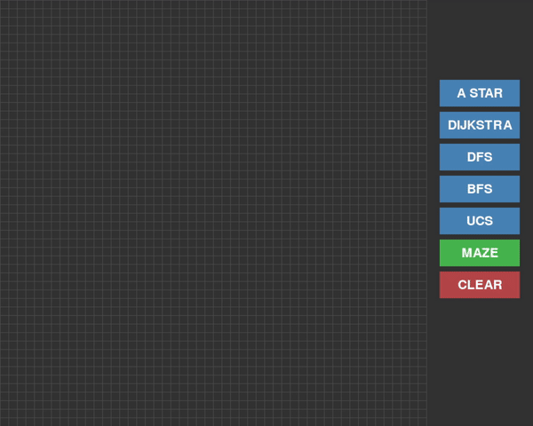
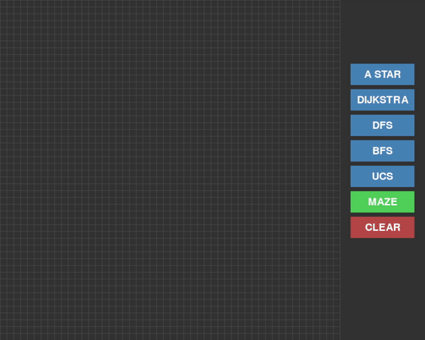

# Pathfinding Algorithm Visualizer

An interactive Python application that visualizes various pathfinding algorithms and a maze generation algorithm using Pygame. This tool helps users understand how different pathfinding algorithms work by providing a real-time visual representation of their search patterns and final paths.




## Features

- **Multiple Algorithm Support:**
  - A* (A-Star)
  - Dijkstra's Algorithm
  - Depth-First Search (DFS)
  - Breadth-First Search (BFS)
  - Uniform Cost Search (UCS)
  - **Maze Generation**: Generate random mazes using a Depth-First Search (DFS) based algorithm.

- **Interactive Grid:**
  - Left-click to place:
    - Start node (first click)
    - End node (second click)
    - Barriers (subsequent clicks)
  - Right-click to erase nodes
  - Clear button to reset the grid
  - **Maze Generation Button**: Create a random maze layout to test pathfinding algorithms.

- **Real-time Visualization:**
  - Color-coded states:
    - Gray: Unvisited nodes
    - Washed Blue: Visited nodes
    - Light Blue: Currently exploring
    - White: Barriers/walls
    - Orange: Start node
    - Red: End node
    - Navy Blue: Final path

- **Performance Metrics:**
  - Execution time measurement for each algorithm
  - Path length calculation
  - Node position tracking

## Technical Details

- Built with Python and Pygame
- 50x50 grid layout
- Manhattan distance heuristic for A* algorithm
- Custom node class for efficient grid management
- Priority Queue implementation for optimal pathfinding
- Modular design for easy algorithm addition

## Controls

- **Mouse Controls:**
  - Left Click: Place nodes/barriers
  - Right Click: Remove nodes/barriers
  
- **Button Interface:**
  - Algorithm selection buttons
  - Maze generation button to create a random maze
  - Clear button for grid reset

## Requirements

- Python 3.x
- Pygame
- Collections (Python standard library)
- Queue (Python standard library)

## Installation

```bash
# Install required packages
pip install pygame
```

## Usage

```bash
python pathFinding.py
```

1. Left-click to place the start node (orange)
2. Left-click to place the end node (red)
3. Left-click to draw barriers (black)
4. Select an algorithm using the buttons on the right
5. Watch the visualization in real-time
6. View the final path and execution time

## Algorithm Characteristics

- **A* (A-Star)**: Best overall performance, uses heuristics for informed searching
- **Dijkstra**: Guarantees shortest path, explores radially
- **DFS**: Memory-efficient, but doesn't guarantee shortest path
- **BFS**: Guarantees shortest path in unweighted graphs, explores level by level
- **UCS**: Similar to Dijkstra's, optimal for weighted graphs
